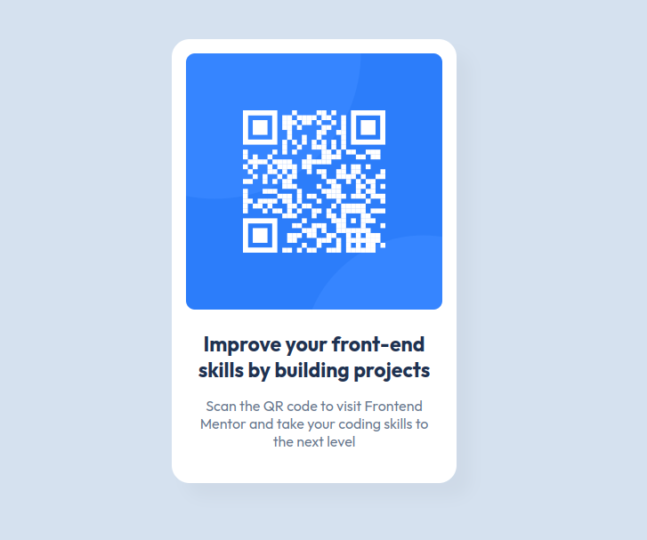

# QR code component solution

This is a solution to the [QR code component challenge on Frontend Mentor](https://www.frontendmentor.io/challenges/qr-code-component-iux_sIO_H). 

## Table of contents

- [Overview](#overview)
  - [Screenshot](#screenshot)
  - [Links](#links)
- [My process](#my-process)
  - [Built with](#built-with)
  - [What I learned](#what-i-learned)
  - [Continued development](#continued-development)
- [Author](#author)

## Overview

### Screenshot

### Links

- Solution URL: [Click Here](https://github.com/faizraeim/qr-code-component)
- Live Site URL: [Click Here](https://faizraeim.github.io/qr-code-component/)

## My process

### Built with

- Semantic HTML5 markup
- CSS custom properties
- Flexbox

### What I learned

The two main things I learned are controlling the div to be centered perfectly, using help and instructions from the websites, and implementing others solutions to my problem.

### Continued development

I will be continuing my development by learning more about CSS and HTML and also learning more about JavaScript.

## Author

- Website - [Faizey.co](https://www.faizey.co)
- Frontend Mentor - [@faizraeim](https://www.frontendmentor.io/profile/faizraeim)
- LinkedIn - [@faizey](https://www.linkedin.com/in/faizey)
- Twitter - [@faizraeim](https://www.twitter.com/faizraeim)
